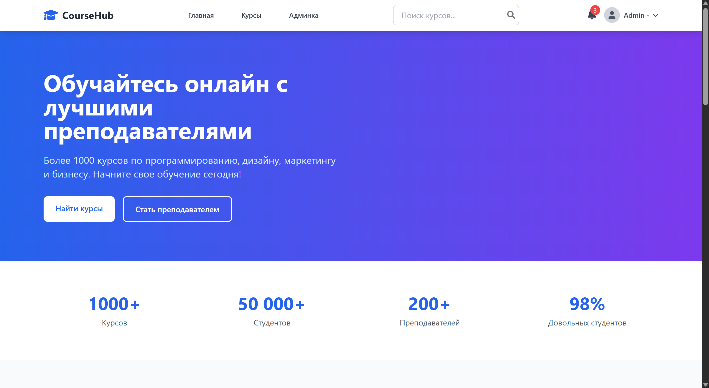
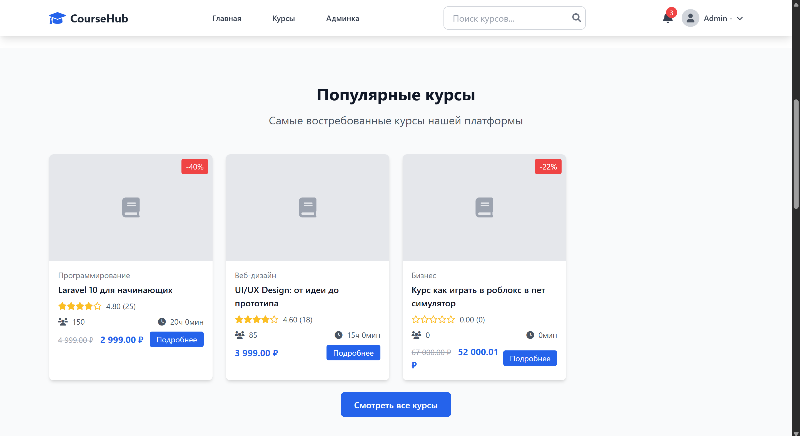
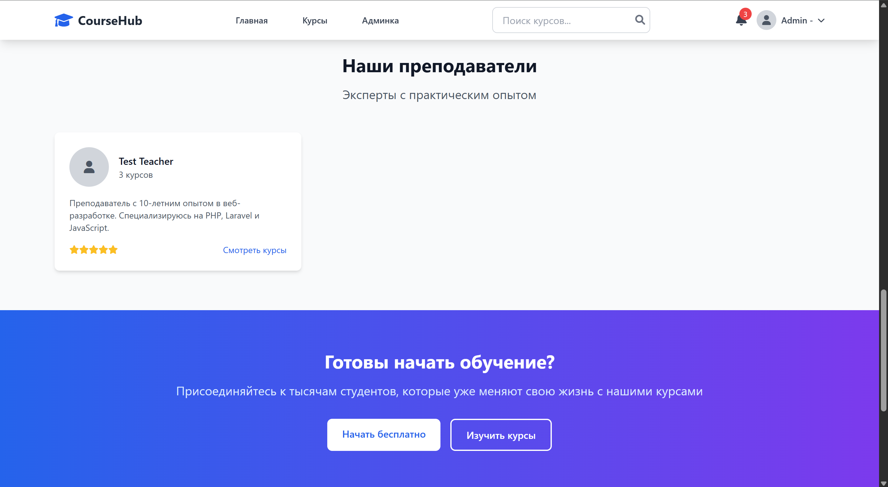
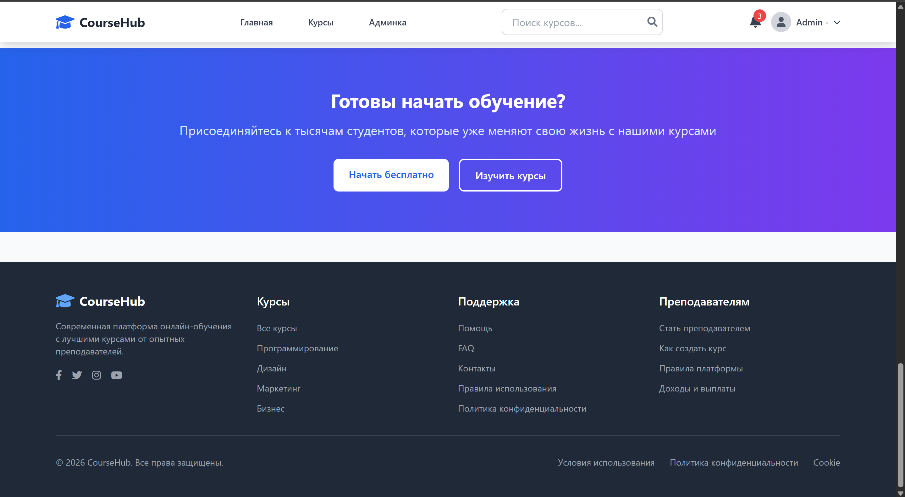
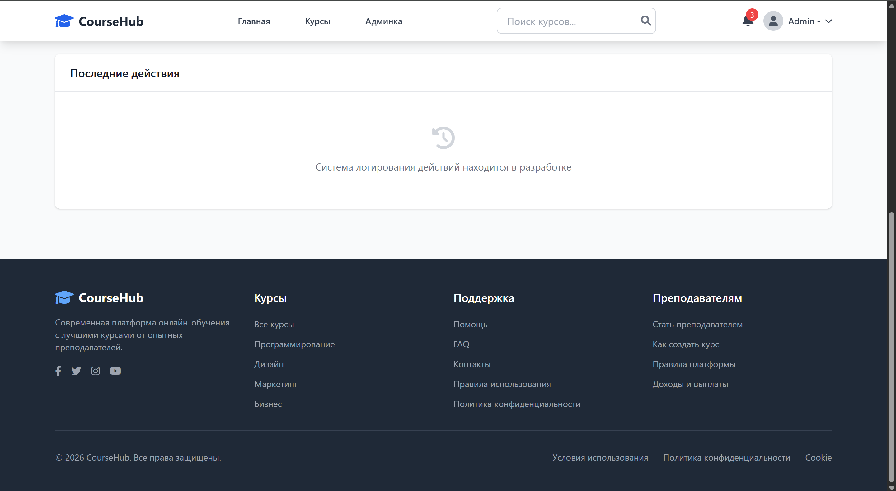
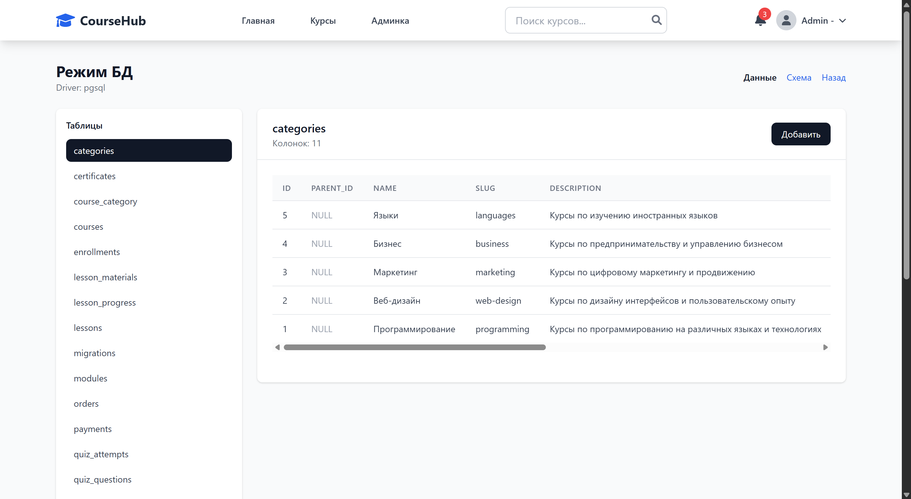
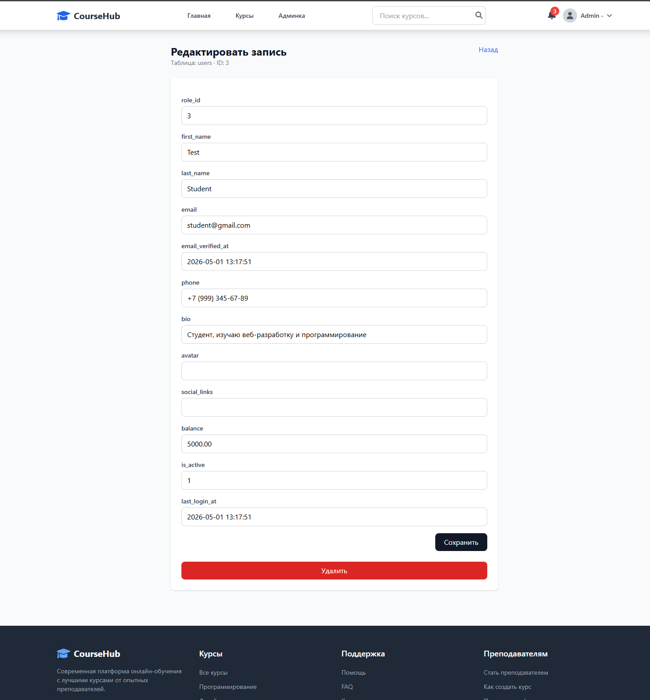
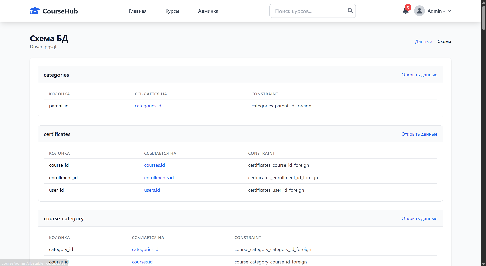

<h1 align="center">CourseHub 🎓</h1>

<p align="center">
  <strong>Современная платформа для онлайн-обучения с поддержкой десктопных клиентов.</strong>
</p>

<p align="center">
  
</p>

## ✨ Особенности
- 🚀 **Laravel Backend**: Мощный и быстрый бэкенд на PHP 8.1 / Laravel 10.
- 🗄 **PostgreSQL**: Надежное хранение данных.
- 💻 **Десктоп-клиент (Electron)**: Полноэкранный, быстрый и нативный опыт работы для Windows ПК.
- 🎨 **Красивый UI**: Современный, адаптивный дизайн с плавными анимациями.
- 👥 **Система ролей**: Разделение на Студентов, Преподавателей и Администраторов.

---

## 📸 Галерея интерфейсов

### Дашборд студента и Плеер курса
<p align="center">
  
  
</p>

### Дашборд преподавателя и Аналитика
<p align="center">
  
  
</p>

### Десктопное приложение и Дополнительные экраны
<p align="center">
  
  
</p>

### Прочие интерфейсы платформы
<p align="center">
  
  
  
  
</p>

---

## 🚀 Установка (Для разработчиков)

Если вы получили проект и хотите его развернуть без долгой настройки:

1. **Склонируйте репозиторий**:
   ```bash
   git clone https://github.com/kirsll/CourseHub-web-app-.git
   cd CourseHub-web-app-
   ```
2. **Восстановите зависимости**: 
   Распакуйте содержимое архива `CourseHub_Dependencies.zip` прямо в корневую папку (это восстановит `node_modules`, `vendor` и `.env` файл).
3. **Запустите локальный сервер**:
   ```bash
   php artisan serve
   ```
4. **Десктоп-клиент**: 
   Установочный файл `.exe` для Windows находится в папке `desktop-client/dist/`.

## 🛠 Стек технологий
* **Backend**: Laravel, PHP
* **Frontend**: Blade Templates, Vanilla CSS/JS
* **Desktop**: Electron, Node.js
* **Database**: PostgreSQL
